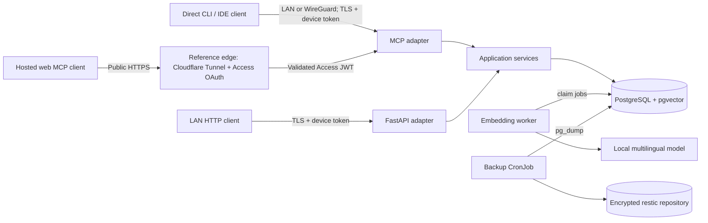

# Architecture

Knowledge Vault separates protocol adapters from application services. MCP and FastAPI validate
and authorize requests, then invoke the same ingestion, search, and administration services.
Those services depend on domain models, SQLAlchemy repositories, and an embedding provider—not on
MCP or HTTP request objects.

The diagram shows the maintained homelab reference profile. MCP does not require Cloudflare,
Minikube, LAN addressing, or WireGuard. Another deployment can substitute an authenticated HTTPS
gateway, private overlay, managed MCP transport, or different identity provider. If its credential
format differs from the existing Cloudflare Access JWT or device bearer token, implement it as a
new authentication adapter with contract and threat-model coverage; never bypass origin
authentication or scope checks.

## Runtime components

- API: one non-root process serving `/mcp`, `/api/v1`, health, and metrics. Durable state lives
  only in PostgreSQL; MCP sessions and rate-limit windows are held in memory, which is why the
  chart runs a single API replica and clients re-initialize after a restart.
- Worker: claims persistent embedding jobs with `FOR UPDATE SKIP LOCKED`, batches local inference,
  and retries with capped exponential backoff and jitter. Claims carry a lease: a claim that
  outlives `KNOWLEDGE_VAULT_EMBEDDING_CLAIM_TIMEOUT_SECONDS` returns to the queue. The same
  process periodically expires abandoned flush batches and purges staging metadata.
- PostgreSQL: the source of truth for assertions, sources, lifecycle state, conflicts, flush state,
  deletion audit records, jobs, text indexes, and vectors.
- Migration Job: executes Alembic; API and worker init containers wait until the database is at
  the newest revision shipped in their image.
- Watchdog (optional CronJob): reads heartbeats and job counters, fails when the worker or the
  backups stop, and can notify a webhook. See [monitoring](runbooks/monitoring.md).
- Optional tunnel, ingress, internal PostgreSQL, and backup workloads are separately enabled.

In the reference profile, the public trust boundary ends at Cloudflare Access and the outbound-only
tunnel; the origin also validates the signed Access assertion and refuses any request for a
published hostname that lacks one. The private trust boundary is the LAN/WireGuard route plus a
unique scoped device token; with `cloudflareAccess.privateHosts` set, device tokens are accepted
only for those hostnames. An alternative edge must define and validate
an equivalent origin-verifiable identity boundary. PostgreSQL, model cache, and metrics stay
cluster-private.
Assertions retrieved from storage are always labeled and handled as untrusted data; they cannot
become server or skill instructions.

## Data flow

Ingestion is a three-phase protocol. `begin` fixes exact part and item totals under an idempotency
key. Each numbered `append` stores a hash and validated staging rows. `commit` locks the batch,
checks completeness, performs exact deduplication and enrichment/supersession/conflict decisions,
inserts source links and embedding jobs in one transaction, and retains a stable commit result for
replay. An incomplete batch can be aborted without touching committed assertions.

Search independently obtains full-text and optional vector candidates, combines them using
weighted reciprocal-rank fusion (0.55 text / 0.45 vector), applies authorization-safe filters, and
uses a signed cursor. Until an embedding is ready, text search remains available.

See the ADRs in [decisions](decisions/) for the durable choices behind this design.
