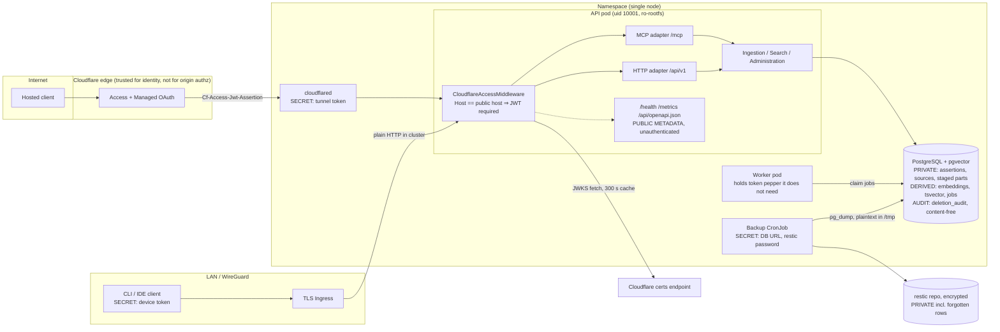

# Independent solution review — 2026-10-01

Review of commit `1125a87ae36e2cf93d73c5f78fd13331b4f62e5a` (`main`), produced by following
[independent-solution-review-prompt.md](../../independent-solution-review-prompt.md). All probes
used synthetic data against disposable PostgreSQL containers and a disposable API process; no live
cluster, Cloudflare resource, Secret, `.env`, or public endpoint was read or contacted.

Remediation work that followed this review is tracked in
[2026-10-01-remediation-status.md](2026-10-01-remediation-status.md). Finding IDs (`KV-###`) are
stable across both documents.

> **Incident during the review.** Two local image builds filled the shared Docker data root
> (`/opt`, 46G) to 100% for roughly four minutes. No live container died, the live PostgreSQL data
> directory is on a different filesystem, and every review-built image and container was removed.
> Trivy and Syft could not be rerun at the time; they were rerun during remediation.

## 1. Executive verdict

**Personal production use: conditional go. Public reuse and first tagged release: no-go.** There
are no Critical findings; there is one High and sixteen Medium.

The application core is sound where it matters most. Authentication fails closed, scopes are
enforced server-side on both adapters, exact idempotency holds under concurrency, hard deletion
cascades correctly, and a real-schema backup restores cleanly.

Top risks:

1. **Backups do not run as charted.** The backup CronJob fails on every run under its own
   read-only root filesystem (KV-001).
2. **Retention never prunes.** Once backups run, forgotten content stays in backups indefinitely
   (KV-002).
3. **The public/private boundary depends on one exact Host match.** Trailing-dot, duplicate or
   missing Host headers let a device bearer token skip the assertion requirement at the origin
   (KV-003).
4. **The MCP adapter does not deliver per-item rejection or usable error messages.** This
   contradicts a stated invariant and breaks the flush workflow when one item is rejected
   (KV-004, KV-005).
5. **Assertion text reaches logs on database errors** (KV-006).
6. **The documented bootstrap path does not work as written** (KV-016).

**Confidence: medium-high.** Nearly every finding was reproduced against a disposable database or
server. Confidence is lower for image vulnerability state (gates blocked during the review) and
for how Cloudflare's edge treats non-canonical Host headers (not tested live, by rule).

## 2. Scope and evidence

**Commit and worktree.** `1125a87` on `main`, level with `origin/main`. Remote is
`github.com/kimonus/knowledge-vault-mcp`; 7 commits, 0 tags. Pre-existing changes at review time:
`README.md` (+1 line) and untracked `independent-solution-review-prompt.md`.

**Environment.** Linux x86_64, 8 CPU, 14 GiB. Docker 29.1.3, uv 0.12.21 (CI pins 0.12.0), Python
3.12.14, Node 24.15. Pinned installers supplied Helm 4.2.4, kubeconform 0.8.0, gitleaks 8.30.1,
hadolint 2.15.1, actionlint 1.7.12.

**One deliberate deviation.** `Settings` loads `.env` from the working directory
(`src/knowledge_vault/config.py:11`) and a real ignored `.env` exists in the repository. All gates
therefore ran in a clean export of HEAD plus the two worktree changes, so no live configuration
could reach a test process.

**Documents read.** `AGENTS.md`, the historical brief, README, all of `docs/`,
SECURITY/CONTRIBUTING/RELEASING/CHANGELOG/SUPPORT, the plugin skill and golden cases, all source,
tests, migrations, chart, Dockerfiles, scripts and workflows.

**Primary sources (accessed 2026-10-01).**

- MCP transports, 2025-11-25: <https://modelcontextprotocol.io/specification/2025-11-25/basic/transports>
- MCP versioning (current version is 2026-07-28): <https://modelcontextprotocol.io/specification/versioning>
- OpenAI MCP `search`/`fetch` contract: <https://developers.openai.com/api/docs/mcp>
- ChatGPT developer mode: <https://developers.openai.com/api/docs/guides/developer-mode>
- Cloudflare Access JWT validation: <https://developers.cloudflare.com/cloudflare-one/access-controls/applications/http-apps/authorization-cookie/validating-json/>
- Cloudflare Managed OAuth: <https://developers.cloudflare.com/cloudflare-one/access-controls/applications/http-apps/managed-oauth/>
- Ingress NGINX retirement: <https://kubernetes.io/blog/2025/11/11/ingress-nginx-retirement/>
- PyPA advisory database, via `pip-audit`

**GitHub (read-only API).** Public repository. Branch protection on `main` enforces admins, four
required checks, strict and linear history. Secret scanning with push protection, Dependabot
security updates and private vulnerability reporting are enabled. CI on HEAD succeeded in all four
jobs. There were 0 releases, 0 tags, 0 open PRs and 0 open Dependabot or secret alerts.

**Limitations.**

- Trivy and Syft did not run during the review (see section 11).
- Some backup and model-loading probes used pre-existing local images rather than HEAD builds. The
  backup image's `backup.sh` hash matched HEAD exactly. The app image predated the last dependency
  bump (`mcp` 2.1.1 vs 2.2.0).
- No live cluster, Cloudflare or public endpoint was contacted.
- The Codex plugin validator was not installed.

## 3. Architecture and trust boundaries

Dependency direction is as claimed. `domain/` and `services/` import neither MCP, FastAPI nor
Starlette. Both adapters call the same `IngestionService`, `SearchService` and
`AdministrationService` built in `container.py`. PostgreSQL is the only durable store. The
embedding queue is a table claimed with `FOR UPDATE SKIP LOCKED`.

The exception is authentication: the Cloudflare adapter is wired directly into settings, container
and middleware rather than behind an interface.

## 4. Findings

**Critical:** none. The basis is section 6: every anonymous, wrong-scope, forged-assertion and
cross-principal attempt made against the disposable server was rejected.

### High

**[KV-001] High — Backup CronJob cannot succeed under its own security context**

- **Category:** operations. **Confidence:** high.
- **Evidence:** `charts/knowledge-vault/templates/backup.yaml:39-42` sets a read-only root
  filesystem and mounts only `/tmp`. `scripts/backup.sh:15` runs restic with no cache directory.
  Reproduced three times with `--read-only --tmpfs /tmp`: exit 1,
  `unable to open cache: mkdir /var/lib/postgresql/.cache: read-only file system`. Adding
  `RESTIC_CACHE_DIR=/tmp/restic-cache` gave exit 0.
- **Condition:** `backup.enabled=true` with the shipped chart.
- **Impact:** recoverability — no snapshot is ever produced.
- **Why controls are insufficient:** `scripts/ci/test_backup_restore.sh` runs the image without
  `--read-only`, so CI passes.
- **Recommendation:** set `RESTIC_CACHE_DIR` under `/tmp` (or pass `--no-cache`) in the script or
  CronJob, and run the CI smoke test with `--read-only`.
- **Verification:** CI smoke test with `--read-only --tmpfs /tmp` exits 0 and lists a snapshot.

### Medium

**[KV-002] Medium — Backup retention never prunes**

- **Category:** data. **Confidence:** high.
- **Evidence:** `scripts/backup.sh:8-19`. Three runs with keep-daily/weekly/monthly all set to 1
  left three snapshots. Each had a distinct path (`/tmp/tmp.XXXXXXXXXX/knowledge-vault.dump`), and
  restic applied the policy as three separate groups ("keep 1 snapshots" ×3).
- **Condition:** any deployment once KV-001 is fixed.
- **Impact:** unbounded repository growth. Hard-deleted assertions persist in backups
  indefinitely, contradicting `docs/runbooks/backup-restore.md`.
- **Why controls are insufficient:** restic groups by host and path. The path is a random `mktemp`
  directory, and in Kubernetes the hostname is the per-run pod name.
- **Recommendation:** use a fixed dump path and `--host`, or `forget --group-by tags`.
- **Verification:** three runs with keep=1 leave one snapshot.

**[KV-003] Medium — Origin's public/private boundary is an exact-match denylist on one Host value**

- **Category:** security. **Confidence:** high for origin behaviour, low for exploitability
  through Cloudflare.
- **Evidence:** `src/knowledge_vault/api/middleware.py:39-44, 67-75`; `api/app.py:60-66`. With a
  valid device token and no assertion:
  - `Host: public.review.test` (also upper-case and `:443`) → 401, as intended.
  - `Host: public.review.test.` → 200.
  - Duplicate Host headers → 200.
  - HTTP/1.0 with no Host → 200.
  - The required host is derived from `config.publicBaseUrl`, which both shipped values files set
    to the LAN placeholder. Nothing validates it when Access is enabled, and no runbook says to
    change it.
- **Condition:** a leaked device token, plus an edge that forwards a non-canonical Host or an
  Access misconfiguration.
- **Impact:** confidentiality and integrity. The invariant "bearer tokens are accepted only
  through the private hostname" (`docs/threat-model.md`) is not what the code enforces.
- **Why controls are insufficient:** anything that is not byte-equal to the public host falls
  through to bearer authentication.
- **Recommendation:** invert to an allowlist of private hosts (assertion required everywhere
  else), or give the tunnel a separate listener. Add an explicit public-host value validated at
  startup and in the chart.
- **Verification:** the Host variants above return 401; startup fails when Access is enabled and
  the public host is unset or `.invalid`.

**[KV-004] Medium — No per-item rejection through the MCP adapter**

- **Category:** MCP/API. **Confidence:** high.
- **Evidence:** `src/knowledge_vault/mcp/server.py:163-165` types the argument as
  `list[AssertionInput]`, so the SDK validates before `ingestion.py:103-115` can reject per item.
  Over HTTP MCP, a part containing one secret-shaped item returned `isError=True`,
  "1 validation error for append_knowledgeArguments", with no `rejected` list. The error text
  echoes a truncated prefix of the offending content.
- **Condition:** any flush with one invalid or secret-shaped item.
- **Impact:** the whole part is refused. Because totals were fixed at `begin`, the client must
  abort and restart. The `rejected` count is always 0 via MCP.
- **Why controls are insufficient:** the integration test exercises the service with raw dicts;
  the contract test never submits a rejected item.
- **Recommendation:** accept unvalidated items at the tool boundary with an explicit bounded JSON
  schema, and delegate validation to the service.
- **Verification:** contract test — a two-item part with one secret returns
  `accepted=1, rejected=[{index:1,…}]`.

**[KV-005] Medium — Domain and validation errors are opaque on MCP and 500 on HTTP**

- **Category:** MCP/API. **Confidence:** high.
- **Evidence (MCP):** "part already accepted with a different payload", "batch is incomplete:
  missing parts=[2]", not-found and used-token errors all reach the client as bare
  `Error executing tool <name>`. The server logs them as unexpected exceptions with tracebacks.
- **Evidence (HTTP):** `search` with limit 0 or 100000, `conflicts?limit=100000`, and
  forget-preview with a non-UUID return 500. Mixed naive/aware datetimes raise `TypeError` at
  `domain/models.py:58` → 500. A chunked oversize body returns 400, not 413.
- **Condition:** ordinary client mistakes and retries.
- **Impact:** a model cannot distinguish "replay the missing part" from an outage; the flush
  skill's retry rules depend on that distinction.
- **Why controls are insufficient:** only `ToolError` passes the SDK's masking, and only
  `KnowledgeVaultError` has an HTTP handler.
- **Recommendation:** map `KnowledgeVaultError` to `ToolError` with its code and message; raise
  domain errors instead of `ValueError`; normalise or reject naive datetimes.
- **Verification:** an MCP early commit returns the missing-parts message; the HTTP cases return
  4xx problem details.

**[KV-006] Medium — Assertion text and SQL parameters reach logs on database errors**

- **Category:** security. **Confidence:** high.
- **Evidence:** `persistence/database.py:20-22` has no `hide_parameters`. An append containing
  `\u0000` returned 500, and the server log contained the synthetic marker twice: once in
  PostgreSQL's `CONTEXT: JSON data …`, and once in SQLAlchemy's `[parameters: {…}]`. These lines
  are plain-text tracebacks outside structlog redaction, as are uvicorn access lines. Tokens and
  JWTs were never logged (0 occurrences).
- **Condition:** any database error on a statement carrying content — a NUL byte, or the
  unique-violation race in KV-024.
- **Impact:** violates the "logs never contain assertion content or SQL values" invariant.
- **Why controls are insufficient:** redaction covers only structlog event fields.
- **Recommendation:** `hide_parameters=True`; reject NUL in content; one exception handler logging
  type and code only; route stdlib and uvicorn logging through the JSON redactor.
- **Verification:** repeat the NUL probe; the marker does not appear in the log.

**[KV-007] Medium — Secret detection is narrow and covers only `content`**

- **Category:** security. **Confidence:** high.
- **Evidence:** `domain/secrets.py:11-27` (seven patterns); `domain/models.py:55` (content only).
  Synthetic probes, grouped:
  - **Accepted, shapes named in `AGENTS.md`:** PostgreSQL and MongoDB connection strings,
    basic-auth URLs, cookie headers.
  - **Accepted, common token formats:** `api_key=`, `token:`, `client_secret=`, Slack, Google,
    Stripe, GitHub fine-grained and GitLab tokens, an AWS secret key assignment, a PGP private key
    block.
  - **Accepted, this system's own credentials:** the `kv_` device token format and a Cloudflare
    tunnel token.
  - **Accepted, evasions:** full-width and zero-width variants of otherwise-rejected values.
  - **Accepted, other fields:** secrets in `sources[].url` userinfo or query, `sources[].title`,
    `sources[].publisher`, and `topics`.
  - **False positives:** "password: required" and plain prose containing "bearer …" are rejected.
- **Condition:** a client submits such text.
- **Impact:** credentials become durable and searchable, then reach backups.
- **Why controls are insufficient:** the threat model admits pattern limits, but the named
  categories and non-content fields are simply unchecked.
- **Recommendation:** NFKC-normalise and strip zero-width characters before matching; add
  URL-userinfo, key=value credential, cookie and own-token patterns; scan all string fields;
  reject URL userinfo.
- **Verification:** the probe list rejects each case.

**[KV-008] Medium — Correction and deduplication can silently no-op while reporting success**

- **Category:** correctness. **Confidence:** high.
- **Evidence:** `services/ingestion.py:238-248, 209-210`. Three reproduced cases:
  - Correct A→B, then correct B back to A's text. Result: `confirmed_existing: 1, superseded: 1`,
    but A stays `superseded` and B stays `current`; a default search for the term returns nothing.
  - Resubmitting an `uncertain` assertion as `current` raises confidence to 0.9 but leaves status
    `uncertain`.
  - Forgetting a successor leaves its predecessor `superseded` and hidden.
- **Condition:** a user reverts to an earlier statement, or re-affirms one.
- **Impact:** integrity of the current view; counts misreport.
- **Why controls are insufficient:** the exact-duplicate path returns before supersession logic
  and ignores `status` and `supersedes_id`.
- **Recommendation:** on a duplicate carrying `supersedes_id`, supersede the target and revive the
  existing row, or reject explicitly. Derive the `superseded` count from rows changed.
- **Verification:** the A→B→A sequence yields A current and B superseded, or a clear error.

**[KV-009] Medium — Staging expiry and purge are never executed**

- **Category:** data. **Confidence:** high.
- **Evidence:** `services/ingestion.py:367` (`expire_and_purge`) has no caller anywhere. After
  worker loop iterations, an abandoned batch 30 days past expiry was still `open` with its staged
  part. `commit` ignores `expires_at`; a batch 30 days expired committed. `confirmation_tokens`
  rows are never purged.
- **Condition:** any abandoned flush.
- **Impact:** staged assertion text is retained indefinitely, contradicting
  `docs/data-model.md`. `staging_retention_seconds` has no effect.
- **Why controls are insufficient:** the function is untested and unwired.
- **Recommendation:** call it from the worker loop; check expiry in commit; purge used and expired
  confirmation tokens.
- **Verification:** integration test — an expired batch becomes `expired` with zero parts after
  one worker tick.

**[KV-010] Medium — Embedding queue has no lease recovery, and re-embedding is unsafe**

- **Category:** correctness. **Confidence:** high.
- **Evidence:** `worker/jobs.py:132-146` releases only claims matching the current worker's
  hostname. Reproduced:
  - Jobs claimed by a crashed worker stay `claimed` forever for a new pod.
  - One failing text marks the whole batch dead (four of four jobs `dead`, assertions `failed`).
  - `knowledge-vault-reembed` raises a unique violation for the current model and on any second
    run.
  - `claim` does not filter by model. A worker loaded with model A processed model-B jobs and
    labelled the vectors as model B.
  - Search does not filter by model, so a rebuild mixes vector spaces.
- **Condition:** OOM or SIGKILL, one bad input, or any model change.
- **Impact:** permanently pending or failed embeddings with no requeue path; wrong similarity
  during rebuild.
- **Why controls are insufficient:** ADR 0004 promises leases, but only graceful shutdown
  releases.
- **Recommendation:** reclaim claims older than a timeout; fall back to per-item on batch failure;
  make rebuild an upsert; filter claim and search by the configured model.
- **Verification:** integration tests for each case above.

**[KV-011] Medium — Default embedding configuration cannot work and degrades search badly**

- **Category:** operations. **Confidence:** high for behaviour, measured on a pre-existing image
  with the same `providers.py` logic.
- **Evidence:** `embeddings/providers.py:33-41` only sets `local_files_only` when the model ID is
  an existing path. Chart defaults enable embeddings with a hub ID. The cache PVC mounts at
  `/models` but nothing points Hugging Face at it. With no network, each embed attempt took 73.2 s
  and 69.5 s, and the failure is not cached, so every search repeats it.
- **Condition:** embeddings enabled without `embeddingModel` set to a local path, or restricted
  egress.
- **Impact:** every search blocks about 70 s before text fallback; jobs go dead. With egress
  allowed, the pod attempts an unpinned runtime download, which the runbooks forbid.
- **Why controls are insufficient:** the runbook installs with embeddings disabled and never
  states the path requirement.
- **Recommendation:** always load local-only and offline; require a path when enabled; cache load
  failure with a back-off.
- **Verification:** with no model present, search returns in under a second with
  `embedding_degraded=true`.

**[KV-012] Medium — Provenance is write-only**

- **Category:** MCP/API. **Confidence:** high.
- **Evidence:** `services/search.py:39-58`; `domain/models.py:74-93`. A source row exists in the
  database, but no field of `get_knowledge`, `fetch`, `search_knowledge` or
  `/api/v1/assertions/{id}` exposes it.
- **Condition:** any retrieval.
- **Impact:** the mission's "assertions with provenance" cannot be consumed.
- **Why controls are insufficient:** `get` loads sources and then discards them.
- **Recommendation:** add bounded `sources` to `AssertionView` and to fetch metadata.
- **Verification:** a contract test asserts the source URL round-trips.

**[KV-013] Medium — Migration scheme will break on the second migration**

- **Category:** data. **Confidence:** high (static).
- **Evidence:**
  - `migrations/versions/0001_initial.py:16` calls `Base.metadata.create_all`, so revision 0001
    creates whatever the models currently say.
  - `charts/…/deployment-api.yaml:32` and `deployment-worker.yaml:28` wait on
    `grep -q 0001_initial`, which will never match once head moves.
  - `job-migration.yaml:7` is a post-upgrade hook, so new pods start before the migration runs.
  - There are no CHECK constraints for the enumerated columns, although `docs/data-model.md` says
    there are.
  - There is no vector index (acceptable at personal scale, but undocumented).
- **Condition:** adding migration 0002.
- **Impact:** failed fresh installs, pods stuck in init, or new code on an old schema.
- **Why controls are insufficient:** only one revision exists, so nothing exercises the path.
  Upgrade, downgrade and re-upgrade of 0001 all passed.
- **Recommendation:** freeze 0001 as explicit DDL; have init containers compare current to heads;
  add enum CHECKs.
- **Verification:** a second revision installs fresh and upgrades cleanly in CI.

**[KV-014] Medium — NetworkPolicy blocks the chart's own PostgreSQL where it is enforced**

- **Category:** Kubernetes. **Confidence:** high (static, rendered).
- **Evidence:** `charts/…/networkpolicy.yaml:8-21` selects every pod in the release, including
  PostgreSQL, and allows ingress only on TCP 8000. Other gaps: ingress from all namespaces, egress
  to 5432 anywhere, and no default egress for JWKS (443) or the backup repository.
- **Condition:** a CNI that enforces NetworkPolicy.
- **Impact:** API, worker and migration cannot reach the bundled database. Where the policy is not
  enforced it provides no isolation, although the threat model lists it as a control.
- **Why controls are insufficient:** kubeconform validates schema, not connectivity.
- **Recommendation:** per-component policies (PostgreSQL from api/worker/migration/backup on 5432;
  API from ingress controller and cloudflared only), with documented egress for JWKS and backups.
- **Verification:** install on a kind cluster with an enforcing CNI and reach Ready.

**[KV-015] Medium — Rate limiting does not cover MCP**

- **Category:** security. **Confidence:** high.
- **Evidence:** `mcp/server.py:49-57` has no limiter. With a limit of 3 per minute, 12 MCP tool
  calls produced 0 errors, while HTTP returned 200, 200, 200, 429, 429, 429. The 429 carries no
  `Retry-After`, although `docs/runbooks/troubleshooting.md` tells operators to respect it. Forty
  invalid-token attempts were not throttled. `auth/cloudflare.py:107-125` performs one outbound
  JWKS fetch per unknown `kid`: 50 assertions produced 50 fetches.
- **Condition:** a runaway client, or an unauthenticated LAN or in-cluster caller sending junk
  assertions.
- **Impact:** availability; the documented control is absent on the primary adapter.
- **Why controls are insufficient:** the limiter is wired only into the FastAPI dependency.
- **Recommendation:** enforce limits in a shared guard; add `Retry-After`; add a minimum refresh
  interval for JWKS.
- **Verification:** the same probes show MCP errors after the limit and one fetch for many unknown
  kids.

**[KV-016] Medium — Documented bootstrap and contract examples do not work as written**

- **Category:** documentation. **Confidence:** high.
- **Evidence:**
  - `docs/runbooks/minikube.md` uses `--principal-id` and `--scope`. The script rejects
    `--principal-id`. With that fixed, repeated `--scope` silently yields only `knowledge:write`.
  - `minikube.md` and `README.md` use the generated single-object record as `bootstrap-tokens`.
    `TokenAuthenticator.from_json` raises `TypeError`, so the API crash-loops.
  - `docs/runbooks/tokens.md` uses Secret name `knowledge-vault-runtime`; everywhere else it is
    `knowledge-vault-auth`.
  - The runbook's verification commands use `knowledge-vault-api` and similar; the chart renders
    `knowledge-vault-knowledge-vault-api`.
  - `docs/mcp-tools.md` gives `"origin": "explicit"` (not a valid value), calls origin optional
    (it is required), and names `supersedes_assertion_id` (actual field: `supersedes_id`).
  - `troubleshooting.md` says readiness checks schema revision; it runs only `SELECT 1`.
  - `docs/threat-model.md` cites prompt-injection and log-content tests that do not exist.
  - `docs/architecture.md` calls the API stateless; it holds MCP sessions and the rate limiter in
    memory.
- **Condition:** an independent user follows the docs.
- **Impact:** failed first deployment and a failed first documented tool call.
- **Why controls are insufficient:** nothing executes the runbook commands.
- **Recommendation:** fix the commands; accept both record forms with a clear error; test the
  documented examples.
- **Verification:** a scripted run of the runbook commands succeeds.

**[KV-017] Medium — The running deployment has drifted from the repository (outside the repo)**

- **Category:** operations. **Confidence:** high on facts, medium on impact.
- **Evidence (Docker metadata only):**
  - The live API container ran image `84ba5e543102`, tagged `knowledge-vault:local`, built
    2026-09-30. It contains PyJWT 2.13.0, for which `pip-audit` lists 13 advisories fixed in
    2.14.0/2.15.0. HEAD locks 2.15.1.
  - The live worker ran an untagged image built 2026-08-30.
  - The Docker root was at 89% with about 24 GB of reclaimable images; one local build filled it.
- **Impact:** the public JWT path runs on a library version the repository already replaced. Most
  of those advisories require mixed HMAC/asymmetric algorithms or `PyJWKClient`, which this code
  does not use, so limited exposure is inferred rather than asserted. API and worker are on
  different builds from a mutable tag.
- **Recommendation:** deploy both from one digest-pinned build of HEAD; prune the Docker root;
  alert on disk.
- **Verification:** both pods report the same image digest and PyJWT ≥ 2.15.

### Low

**[KV-018] Low — Observability gaps**

- **Category:** operations. **Confidence:** high.
- **Evidence:**
  - `observability/metrics.py` defines tool-call, search-latency and pool metrics that are never
    updated (0 samples).
  - Queue-depth gauges are set only in the worker, which exposes no endpoint and has no probes.
  - `otel_enabled` is unused.
  - 300 anonymous random paths grew the request counter from 26 to 326 series.
  - Assertion rejections are not logged or counted and carry no request ID.
  - `/metrics`, `/health/*` and `/api/openapi.json` are anonymous on the LAN ingress.
  - Readiness reports configuration, not embedding health.
- **Recommendation:** label by route template; wire or delete the dead metrics; serve worker
  metrics.
- **Verification:** the cardinality probe leaves the series count flat.

**[KV-019] Low — No Origin validation on `/mcp`**

- **Category:** MCP/API. **Confidence:** high.
- **Evidence:** `api/app.py:35-41` passes `host="0.0.0.0"` and no `transport_security`, which
  leaves the SDK's Host/Origin protection off. An initialise request with
  `Origin: https://evil.example` returned 200. The specification says servers MUST validate Origin
  and answer 403.
- **Impact:** low today — a bearer header is required, CORS is off, and non-JSON content types are
  refused.
- **Recommendation:** validate Origin against an explicit allowlist.
- **Verification:** a foreign Origin returns 403.

**[KV-020] Low — Chart portability defects**

- **Category:** Kubernetes. **Confidence:** high.
- **Evidence:**
  - Setting `nodeSelector` or `tolerations` yields a YAML parse error in `deployment-api.yaml`.
  - `values.schema.json` leaves `ingress`, `backup`, `networkPolicy` and `internalPostgresql`
    untyped; `networkPolicy.enabeld=false` renders without error.
  - Init containers have no resource bounds.
  - The default ingress class is `nginx`, and upstream ended maintenance of Ingress NGINX in March
    2026.
  - The default image repository is `knowledge-vault`, not the published GHCR name.
- **Recommendation:** fix whitespace trimming; type the schema; add resources; make the class
  explicit.
- **Verification:** a render matrix in CI.

**[KV-021] Low — Advertised OAuth metadata points nowhere useful**

- **Category:** MCP/API. **Confidence:** high.
- **Evidence:** `mcp/server.py:71-78`. On the private host, a 401 advertises `resource_metadata`
  at the public base URL. The metadata lists `authorization_servers` from `authIssuerUrl`, which
  the values files set to the LAN host; `/.well-known/oauth-authorization-server` there returns
  404.
- **Recommendation:** omit authorization servers on the bearer path, or serve per-host metadata.

**[KV-022] Low — Tests give more confidence than they earn in specific places**

- **Category:** tests. **Confidence:** high.
- **Evidence:**
  - 59 tests; 0 skipped, xfailed or deselected.
  - No concurrency tests, although the probes show the core paths are safe.
  - `tests/contract/test_mcp_contract.py` injects the auth context directly, so no test crosses
    the real HTTP and auth stack for MCP.
  - `pyproject.toml` omits `worker/main.py` (the shutdown and release logic) from coverage.
  - Branch coverage is 85.33% against a gate of 85%.
  - The backup smoke test uses a synthetic table without a read-only filesystem.
  - Tests inherit the developer's `.env`.
- **Recommendation:** add the probes in this report as tests; isolate settings from `.env` in
  tests.

**[KV-023] Low — Release path is unexercised**

- **Category:** supply-chain. **Confidence:** high.
- **Evidence:** 0 tags and 0 releases, so `release.yml` has never run. It scans a
  `release-candidate` build but pushes a separate rebuild, publishes `latest`, and builds amd64
  only. The pgvector digest is repeated in five files outside Dependabot's reach. There is no tag
  ruleset. `orjson` and `python-json-logger` are declared but unused.
- **Strengths:** all actions are SHA-pinned, the token is least-privilege, signing is keyless, and
  CI on HEAD is green.
- **Recommendation:** dry-run the workflow on a pre-release tag; scan the pushed digest; protect
  `v*` tags.

**[KV-024] Low — Smaller correctness and hygiene items**

- **Category:** correctness. **Confidence:** high.
- **Evidence:**
  - `begin` replay returns `replayed: false`.
  - Paging while inserting returned 48 results for 42 distinct rows.
  - Six concurrent first commits of the same new text: five failed with a raw unique-violation;
    all six succeeded on retry with one row.
  - Conflicts can never be resolved (no code sets `resolved_at`) and are never detected for
    topic-less assertions.
  - `environment` is a free string, so a typo skips the pepper check.
  - `append_knowledge`'s schema has no `maxItems`.
  - `generate_token.py` accepts the pepper in argv and prints the token to stdout by default.
- **Recommendation:** fix individually; catch the unique violation and retry.

## 5. Requirement traceability matrix

| Requirement | Implementation | Test | Docs | Status | Risk |
|---|---|---|---|---|---|
| Services independent of MCP/FastAPI | `services/*`, `domain/*` imports | indirect | architecture.md | implemented | low |
| PostgreSQL sole durable store; no Redis | `tables.py`, `jobs.py` | integration | ADR 0002/0004 | implemented | low |
| Anonymous MCP and `/api/v1` forbidden | `api/auth.py`, SDK verifier | e2e + probes | threat-model | implemented | low |
| Scopes enforced in server code | `api/auth.py`, `mcp/server.py` | probes | mcp-tools.md | implemented | low |
| Digests only; constant-time; rotation overlap | `auth/tokens.py` | unit | tokens.md | implemented | low |
| Origin validates Access JWT (sig, iss, aud, exp, email) | `auth/cloudflare.py` | unit + probes | cloudflare-access.md | implemented | low |
| Assertion required on public host | `middleware.py` | unit (exact host only) | threat-model | partial (KV-003) | medium |
| Cloudflare identities never admin | `config.py`, probe 403 | unit + probe | AGENTS | implemented | low |
| Exact begin/append/commit idempotency | `ingestion.py` | integration + probes | architecture.md | implemented | low |
| No silent merge or overwrite; correction atomic | `ingestion.py` | integration | data-model.md | partial (KV-008) | medium |
| Secret detection with per-item rejection | `secrets.py`, `ingestion.py` | unit (4 patterns) | mcp-tools.md | partial; contradicted on MCP (KV-004, KV-007) | medium |
| Stored knowledge treated as untrusted | instructions, `fetch` metadata | none | threat-model | partial (flag only on `fetch`) | low |
| Confirmed hard deletion; content-free audit | `administration.py` | integration + probes | data-model.md | implemented | low |
| Bounded results and batches | settings, service checks | integration | — | implemented (schema lacks bounds) | low |
| Source URLs never fetched | no fetch code exists | — | — | implemented | low |
| Staging expiry and purge | `ingestion.py` | none | data-model.md | not implemented (KV-009) | medium |
| Rate limit per principal and class | `api/auth.py` | unit | threat-model | partial, HTTP only (KV-015) | medium |
| Logs free of content and SQL values | `logging.py` | unit (redactor only) | AGENTS | contradicted (KV-006) | medium |
| Migrations in Alembic with constraints | `0001_initial.py` | integration | data-model.md | partial (KV-013) | medium |
| Worker: SKIP LOCKED, bounded retry, dead-letter, safe re-embed | `jobs.py` | integration | ADR 0004 | partial (KV-010) | medium |
| Hardened containers; ClusterIP-only | chart templates | kubeconform | — | implemented (init containers lack resources) | low |
| NetworkPolicies least-privilege | `networkpolicy.yaml` | schema only | threat-model | partial (KV-014) | medium |
| Scheduled encrypted backups, retention, tested restore | `backup.yaml`, `backup.sh` | smoke (synthetic) | backup-restore.md | contradicted for job and retention; restore verified | high |
| Metrics for tools, search, queue, pool | `metrics.py` | none | brief | documentation-only (KV-018) | low |
| OpenAI `search`/`fetch` shapes | `mcp/server.py` | contract + probe | mcp-tools.md | implemented | low |
| Flush skill trigger and golden cases | `plugin/…/SKILL.md` | none (validator absent) | — | not verifiable | low |
| Coverage ≥ 90% / 85% | 95.86% / 85.33% | gate | CONTRIBUTING | implemented (thin margin; one module omitted) | low |

## 6. Security assessment

**Authentication paths — strong.** Results against the disposable server:

- Anonymous `/mcp` and `/api/v1` return 401. On the public host every path, including health and
  metrics, returns 401 without an assertion.
- Rejected assertions: wrong audience, wrong issuer, expired, future `nbf`, other email,
  service-token shape, `alg: none`, HS256, garbage.
- A valid assertion plus an admin bearer still yields 403 on deletion, on both hosts: the
  Cloudflare principal takes precedence.
- An invalid assertion plus a valid admin bearer yields 401.
- The injected marker bearer is not accepted as a credential.
- `X-Forwarded-Host` is ignored.

The weakness is the Host canonicalisation in KV-003.

**Authorization.** Read-only tokens cannot write and read-write tokens cannot delete, on both
adapters. An MCP session cannot be reused by another principal (404). Batches and confirmation
tokens are bound to their principal.

**Data handling.** Tokens and JWTs never appeared in logs. Assertion text did, via database errors
(KV-006). Secret detection is the weakest control (KV-007).

**Deletion.** The preview/confirm boundary is sound. A token is single-use under six concurrent
confirms, expires, and is principal-bound. Sources, jobs and conflicts cascade. The audit row has
no content or hash. Residue is IDs only (in `confirmation_tokens` and batch results), plus backups
(KV-002).

**Injection resistance.** Server instructions and `fetch` metadata label content untrusted; text
is returned verbatim as structured data. `get_knowledge` and `search_knowledge` results carry no
marker. The server never executes or fetches anything from stored content.

**Infrastructure.** Pod hardening is real and uniform. NetworkPolicy is not (KV-014). The worker
receives the token pepper only to satisfy a settings check.

**Supply chain.** Locked graph (129 packages, hashes present, no prereleases), digest-pinned
bases, SHA-pinned actions, checksum-pinned tools. gitleaks is clean across history.

**Out of scope, as the threat model honestly states:** a compromised control plane, node root, a
malicious model, or a holder of admin scope.

## 7. Correctness and durability assessment

- **Transactions and idempotency:** correct. Twelve concurrent `begin` calls returned one batch.
  Eight concurrent commits of one batch returned identical results and two rows.
- **Concurrency gap:** first insert of identical new text across batches fails with a raw error
  and succeeds on retry (KV-024).
- **Migrations:** upgrade from empty, downgrade to base (0 tables left), re-upgrade and
  `alembic check` all passed. The structural risk is in KV-013.
- **Queue:** claim and retry are correct on the happy path. Recovery is not (KV-010).
- **Retrieval:** deterministic fusion. Static pagination was exact (37 of 37, no duplicates);
  under concurrent writes it duplicates. Multilingual text search worked for Russian and Polish.
  Text fallback works but can take 70 s (KV-011).
- **Correction and deletion:** KV-008 for correction; deletion is correct.
- **Restart:** an assertion written before an API restart was readable after it. Graceful shutdown
  took 0.2 s.
- **Restore:** a real-schema dump restored into an empty database with matching row counts, the
  trigger, the extension and working full-text search.

## 8. MCP and client interoperability assessment

- **Protocol.** The pinned SDK negotiated 2025-11-25 with the handshake client. It also recognised
  the current 2026-07-28 envelope, replying with a specific missing-key error rather than
  rejecting the version. The move to 2026-07-28 is optional modernisation, not an incompatibility,
  but there are no tests for it.
- **Tools.** Twelve tools, annotations accurate. The official Inspector 2.4.0 listed all twelve.
- **OpenAI `search`/`fetch`.** Compliant with the current contract: structured content plus the
  same value as JSON text. Result URLs point at an authenticated API path.
- **Codex CLI and headless.** Supported by the private bearer path.
- **Copilot and ChatGPT web.** Depend on Cloudflare Managed OAuth, which was not exercised. The
  docs correctly limit ChatGPT developer mode to web.
- **Generic clients.** Will work, with the error-opacity and per-item caveats (KV-004, KV-005) and
  the confusing discovery metadata (KV-021).
- **Degraded modes.** Database down → readiness 503. JWKS unreachable after the 300 s cache →
  public path fails closed. Worker down → text search still works. Uncertain retry → safe.

## 9. Universality and portability assessment

| Scenario | Assessment |
|---|---|
| Local loopback development | supported by configuration (quick start had the token-record bug) |
| LAN-only | supported by configuration |
| LAN plus WireGuard/overlay | supported as-is; no routing assumptions in code |
| Hosted web client | supported as-is via the reference profile (mobile correctly unclaimed) |
| Generic public OAuth/JWT gateway | requires material refactoring: issuer must end `.cloudflareaccess.com`, header name and email claim are fixed, no adapter interface |
| Non-Cloudflare tunnel or managed transport | same as above |
| Headless CLI/automation | supported as-is |
| Another Kubernetes distribution | supported by configuration, with defects (KV-014, KV-020) |
| External/managed PostgreSQL | supported by configuration; `CREATE EXTENSION` privilege and TLS are undocumented |
| Air-gapped/restricted egress | unclear: model loading (KV-011), JWKS egress, installer scripts download |
| Different embedding model | requires material refactoring for a new dimension (`vector(384)` in the schema); same dimension was unsafe (KV-010) |
| ARM64 | intentionally unsupported (amd64 images and tools) |
| Larger personal dataset | supported by configuration to low tens of thousands; no vector index, per-insert conflict scan |
| Multi-user | intentionally unsupported |

| Dimension | Score | Rationale |
|---|---|---|
| Application-core portability | 4 | Clean service layer; no transport imports |
| Authentication/edge substitutability | 2 | Cloudflare-specific class and config validation; no seam |
| Client interoperability | 3 | Compliant shapes; opaque errors and no per-item rejection on MCP |
| Data-layer portability | 3 | Any PostgreSQL 17 with pgvector via URL; fixed dimension; migration fragility |
| Kubernetes portability | 2 | NetworkPolicy, scheduling render bug, retired ingress default |
| Non-Kubernetes operability | 3 | Runs with `uv`; documented token bootstrap fails |
| Offline/restricted-egress readiness | 2 | Model download attempt; JWKS and backup egress not modelled |
| Architecture documentation accuracy | 2 | Several contradicted statements (KV-016) |
| Operational recoverability | 2 | Restore works; scheduled backup and retention do not |
| Maintainability/extensibility | 3 | Small, typed, linted; dead code and unwired features |

## 10. Kubernetes and operational assessment

- **Hardening.** Every main container is non-root with a fixed UID, read-only root filesystem, all
  capabilities dropped, RuntimeDefault seccomp and no service-account token. The Service is
  ClusterIP. The chart fails closed without Secrets, URLs, an ingress TLS secret or a tunnel
  digest. No secret values appear in rendered manifests.
- **Gaps.** Worker has no probes. Init containers have no resources. API memory limit is 1 Gi, yet
  the API also loads the model for query embedding (risk, not measured). Secret changes do not
  trigger rollouts (the runbook does say to restart).
- **Images.** Multi-stage, locked install, UID 10001, explicit entry point. The version label is
  hard-coded.
- **Observability.** See KV-018.
- **Failure modes.** Single node and single replica are stated honestly as limits.
- **Release engineering.** See KV-023.

## 11. Verification results (at review time)

| Check | Outcome | Notes |
|---|---|---|
| `uv lock --check` | passed | exit 0 |
| `uv sync --locked` | passed | exit 0 |
| `ruff format --check`, `ruff check` | passed | 91 files; ruff 0.16.9 |
| `pyright` | passed | 0 errors; `src` only |
| `pytest tests/unit tests/property tests/contract` | passed | 54 passed |
| `pytest tests/integration tests/e2e` | passed | 5 passed, real pgvector container |
| `pytest --cov …` | passed | 59 passed; 0 skipped/xfailed |
| `check_coverage.py` | passed | 95.86% statements, 85.33% branches |
| `pip-audit` | passed | no known vulnerabilities; project itself skipped |
| `bandit -q -r src` | passed | one informational `nosec` warning |
| `install_security_tools.sh`, `install_kubernetes_tools.sh` | passed | checksums verified |
| `gitleaks git --redact` | passed | 7 commits, no leaks; also clean in `dir` mode |
| `hadolint` | passed | exit 0 |
| `actionlint` | passed | run from repository root |
| `docker build` (app) | passed | 67 s; image later removed |
| `docker build` (backup) | passed | 59 s; image later removed |
| `test_backup_restore.sh …:review` | blocked | interrupted by the disk-full; image removed |
| same script, pre-existing `:release-candidate` image | passed | identical `backup.sh` hash to HEAD |
| `trivy image` (app, backup) | blocked | no space to rebuild; CI ran it green on HEAD |
| `syft` SBOM | blocked | same reason |
| `helm lint`, `helm template`, `kubeconform` (default) | passed | 11 resources valid |
| Same, Cloudflare-enabled | passed | 15 resources valid |
| Alembic upgrade from empty / downgrade / re-upgrade / `check` | passed | |
| MCP Inspector 2.4.0 `tools/list` | passed | 12 tools |
| Full lifecycle over MCP HTTP | passed with findings | KV-004, KV-005, KV-012, KV-024 |
| API restart persistence | passed | |
| Worker retry and degraded-embedding probes | executed, findings | KV-010, KV-011 |
| Real-schema backup, restore, verify | passed | pre-existing backup image |
| Backup under chart security context | failed | KV-001 |
| Markdown local links | passed | 45 checked, 0 broken |
| YAML/JSON parse; `git diff --check` | passed | 15 files |
| Plugin validation | blocked | validator not installed; golden cases reviewed by reading |
| `pre-commit run` | not run | hooks duplicate ruff and pyright |
| Public endpoint TLS/metadata check | not run | chose not to contact the live service |
| Server-side dry run | not run | not authorised |

## 12. Positive evidence

- Exact idempotency holds under concurrency, with row locks on batch, part and token.
- JWT validation is strict: RS256 only, required claims, exact email after case-folding, admin
  scope refused at configuration time.
- Cloudflare identity cannot be upgraded by also presenting an admin bearer token.
- Hard deletion is bounded, two-step, principal-bound, single-use, cascading and content-free in
  audit.
- Secret-shaped items rejected at the service layer are never staged; only code and message are
  kept.
- Staged payloads are deleted at commit; batch results hold IDs and counts only.
- The chart fails closed and is uniformly hardened.
- The supply chain is pinned at every layer, and GitHub protections are properly configured.
- A real backup restores into an empty database and works.
- The documentation is honest about single-node limits, mobile support and backup residue.

## 13. Prioritised remediation roadmap

**P0 — before relying on backups or cutting a release**

| Item | Effort | Risk reduction |
|---|---|---|
| KV-001 restic cache directory; read-only CI smoke test | small | restores the recovery path |
| KV-002 fixed host, or group by tag | small | bounded retention; forgotten data ages out |
| KV-017 redeploy API and worker from one digest of HEAD; prune Docker root | small | removes known-advisory library and version skew |
| KV-016 fix token bootstrap docs and record format | small | first deployment works |

**P1 — next**

| Item | Effort | Depends on |
|---|---|---|
| KV-003 allowlist private hosts; explicit public host value | medium | — |
| KV-004 and KV-005 tool boundary and error mapping | medium | — |
| KV-006 hide parameters; unify logging | small | — |
| KV-007 broaden and normalise secret detection | medium | KV-004 (so rejections surface) |
| KV-009 wire expiry and purge | small | — |
| KV-010 lease timeout, per-item fallback, model filter, rebuild upsert | medium | — |
| KV-011 local-only model loading with failure back-off | small | — |
| KV-015 shared rate limiter; JWKS refresh floor | small | — |

**P2 — before a second schema revision or wider reuse**

| Item | Effort |
|---|---|
| KV-013 freeze 0001, generic revision wait | medium |
| KV-014 per-component NetworkPolicies, tested on an enforcing CNI | medium |
| KV-008 correction semantics | medium |
| KV-012 expose sources | small |
| KV-018 to KV-024 | small each |
| Generic JWT authentication adapter (only if non-Cloudflare edges become a goal) | large |

## 14. Residual risks and intentionally unsupported scenarios

- Single node, single replica, no high availability: deliberate and documented.
- Single user; no multi-tenancy, sensitivity-based authorisation or anonymous access: deliberate.
- No web UI, hosted embeddings or Redis: deliberate, and nothing in this review argues for them.
- Pattern-based secret detection can never be complete; clients must not submit secrets.
- A holder of admin scope can delete; a cluster or node administrator can read everything.
- PostgreSQL dead tuples, WAL and backups retain deleted content for some period by nature.
- ARM64 is unsupported.
- **Unverified by this review:** Cloudflare edge behaviour for unusual Host headers, real-client
  OAuth flows, and whether the live CNI enforces NetworkPolicy.

## 15. Final go/no-go statements (at review time)

- **Safe for the maintainer's current personal production use: yes, conditionally.** No path to
  unauthenticated access was found. The conditions are P0: confirm that a backup snapshot actually
  exists and restores, and redeploy from HEAD.
- **Ready for an independent user to deploy from the public repository: no.** The documented
  bootstrap fails, the backup job fails, the default embedding configuration cannot work, and the
  bundled NetworkPolicy breaks the bundled database on enforcing clusters.
- **Architecture sufficiently universal for the stated variants: partially.** The domain and
  service core is transport-independent and portable. The authentication edge is
  Cloudflare-specific in code, and the chart is reference-profile-specific in practice.
- **Safe to cut the first tagged release: no.** The release workflow has never run, the image-scan
  gates were not reproduced locally at review time, and KV-001 and KV-016 would ship broken to
  first users.
